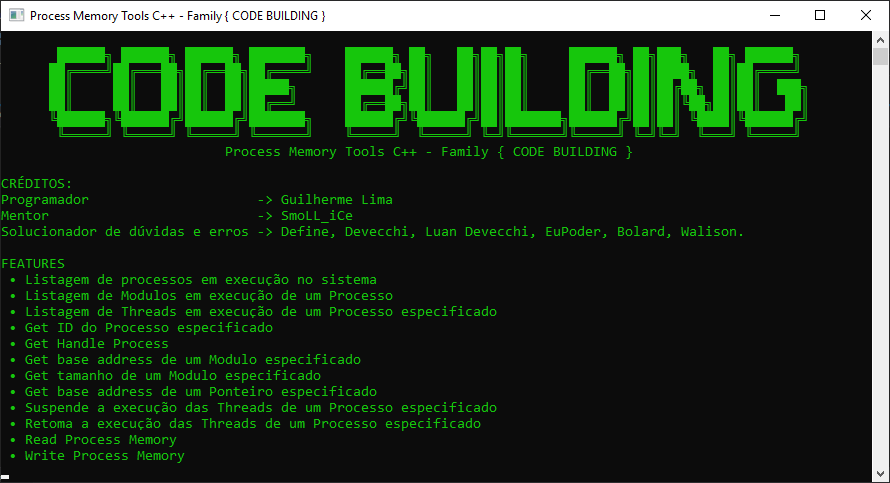

# Process Memory Tools
<h3 align="center">
  
</h3>

-------

    <a href="#Apresentação">Apresentação</a> &bull;
    <a href="#Requisitos">Requisitos</a> &bull;
    <a href="#Features">Features</a> &bull;
    <a href="#References">References</a>

-------

### Apresentação
Manipule processos em execução em sua memória RAM. Este projeto escrito em C++ destina-se a todos que precisam ler/escrever na memória de um determinado processo em execução no Windows.

<h3 align="center">
  
</h3>

> __Nota:__ *Na imagem acima está um Screenshot da tela de boas vindas da aplicação. Nada vos impede que seja alterada ou excluída posteriormente em seus projetos.*

## Requisitos
- __IDE do Visual Studio__ - Para abrir e compilar o projeto ([Download](https://visualstudio.microsoft.com/pt-br/))
- __Sistemas Operacionais Suportados__

|  Operating Systems  | Supported 32-bit | Supported 64-bit |
|:-------------------:|:----------------:|:----------------:|
| Windows XP SP3      |         ✔        |         ✔        |
| Windows Server 2003 |         ✔        |         ✔        |
| Windows Vista       |         ✔        |         ✔        |
| Windows Server 2008 |         ✔        |         ✔        |
| Windows 7           |         ✔        |         ✔        |
| Windows Server 2012 |         ✔        |         ✔        |
| Windows 8/8.1       |         ✔        |         ✔        |
| Windows 10          |         ✔        |         ✔        |

## Features
- [X] Suporte Nativo a processos x86 e x64 (automatic)
- [X] Listagem de Processos em execução no sistema
- [X] Listagem de Modulos de um Processo especificado
- [X] Listagem de Threads de um Processo especificado
- [X] Get ID de um Processo especificado (Comumente chamado de PID)
- [X] Get Handle de um Processo especificado
- [X] Get base address de um Modulo especificado
- [X] Get tamanho de um Modulo especificado
- [X] Get base address de um Ponteiro especificado
- [X] Suspende a execução das Threads de um Processo especificado
- [X] Retoma a execução das Threads de um Processo especificado
- [X] Read / Write Process Memory v1.0
- [ ] Array of byte Scan (Comumente chamado de AOB Scan)

## References
- Documentação do Projeto (Em Breve) – :notebook: [Wiki Pages](https://github.com/guilhermelim/Process-Memory-Tools/wiki)

## Autor
[Guilherme Lima](https://github.com/guilhermelim)

## Créditos
- __Mentor:__ [SmoLL-iCe](https://github.com/SmoLL-iCe)
- __Solucionador de dúvidas e erros:__ `Define#5696, Luan Devecchi.CB#6844, iPower#4714, WalisonBR#6270.`
- __Discord Guilherme Lima:__ *`Guilherme Lima 👑#2384`*
- __Discord__ [{ Code Building }](https://discord.gg/tDbJQ4K)

## License

